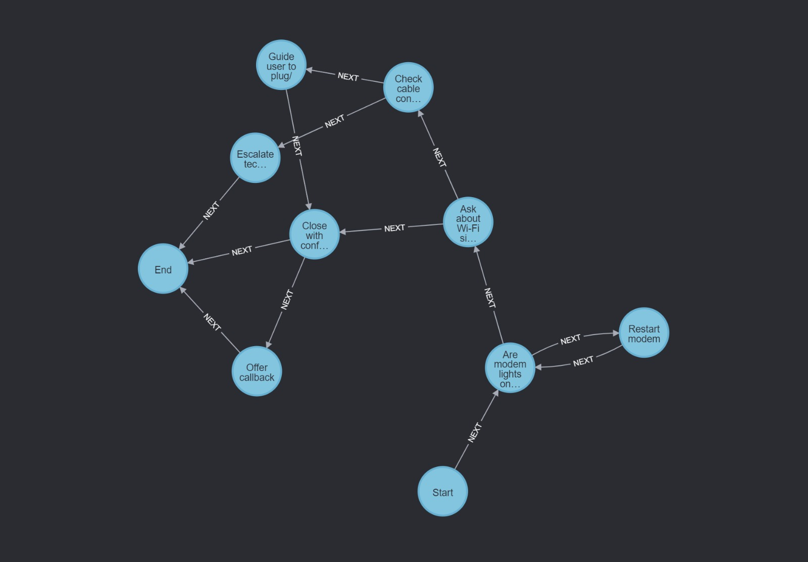

# TroubleshootingBot: Neo4j + Semantic Search + LangGraph + Flask




This project is an **intelligent troubleshooting assistant** that combines the power of:
- **Neo4j** for decision tree representation and navigation,
- **Semantic Search** with SentenceTransformers + FAISS,
- **LangGraph** for building agent workflows,
- **Flask** for a clean and interactive web interface.

---

## Features

- **Semantic understanding** of user questions (e.g., "My modem is off" → "Check modem lights")
- **Graph-powered decision logic** (each troubleshooting step is modeled as a connected node)
- **Script & Article retrieval** to support customer support reps with the right responses
- **Multi-tab UI** to show `Procedure`, `Article`, and `Script` in one place
- **LangGraph Agent** orchestrates intelligent flow between question understanding, node lookup, and graph traversal

---

## Folder Structure

```
TroubleshootingBot_1/
│
├── agent_graph.py         # LangGraph agent + Neo4j integration
├── agent_graph_ui.py      # Flask UI wrapper around the LangGraph agent
├── data.json              # Knowledge base for article/script/procedure
├── workflow.json          # (optional) visual graph workflow template
├── questions.txt          # Sample test questions for QA
├── templates/
│   └── index.html         # Frontend template with 3-tab layout
```

---

## How It Works

1. **User asks a question**
2. **Semantic Search** finds the most relevant node ID
3. **Neo4j** is queried for:
   - The identified node
   - Its connected `next` steps (for procedures)
4. **LangGraph agent**:
   - Returns article + script content for the node
   - Builds a list of next steps as a recommended procedure
5. **Flask** renders it all beautifully in 3 tabs.

---

## Setup Instructions

```bash
# Create a virtual environment (recommended)
conda create -n chat python=3.10
conda activate chat

# Install dependencies
pip install -r requirements.txt
```

### Example `requirements.txt`
```
flask
faiss-cpu
sentence-transformers
neo4j
langchain
langgraph
```

---

## Running the App

Start Neo4j Desktop and make sure your graph is running (with `bolt://localhost:7687`)


Then in terminal:

```bash
python agent_graph_ui.py
```


Open your browser:  
**http://127.0.0.1:5001**

---

## Example Questions

Try any of these:
- “Are the modem lights important to check first?”
- “Should I restart the modem if the internet is not working?”
- “Can the customer request a callback if the issue remains?”


---

## Credits

Created by Zeinab Hajiabotorabi  
Inspired by real-world customer support automation scenarios.

---

## Future Work

- Full LangGraph workflow with memory and tools
- LangChain integration for RAG + QA chains
- Deployment on cloud (Render, Vercel, or GCP)
